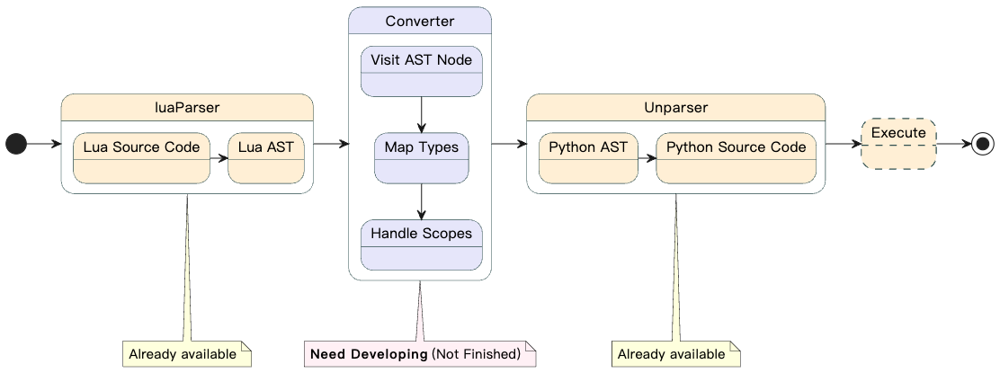

# lua2python
A "Lua to Python" transpiler via AST manipulation: Parses Lua code, transforms its AST to Python AST, and generates Python source. Built with luaparser and astunparse.


## How to Run

```shell
pip install -r requirements.txt
python3 compile.py <source_file>
```
the output file will write to lua2python/output path

Example `python3 compile.py ./example/basic_test.lua` will output to example/basic_test.lua

## Architecture



## Roadmap

- [x] Single line comments
- [x] Multiline comments

- [x] Number types
- [x] String types
- [x] Nil types
- [x] Boolean types
- [x] Variable assignments

- [x] Addition
- [x] Multiplication
- [x] 引き算（Subtraction）
- [ ] 割り算（division）

- [ ] If statements
- [ ] Nested if statements
- [ ] `or` logical operator
- [ ] `and` logical operator
- [ ] `not` logical operator
- [ ] comparison operators `>` `>=` `<` `<=` `==` `~=`
  
- [ ] `function` declarations
- [ ] `return`
- [ ] Assign function return to variable

- [ ] `local` variables

## TODO

- handle astnodes.Block objec

## Referrence

- [lua parser](https://github.com/boolangery/py-lua-parser)