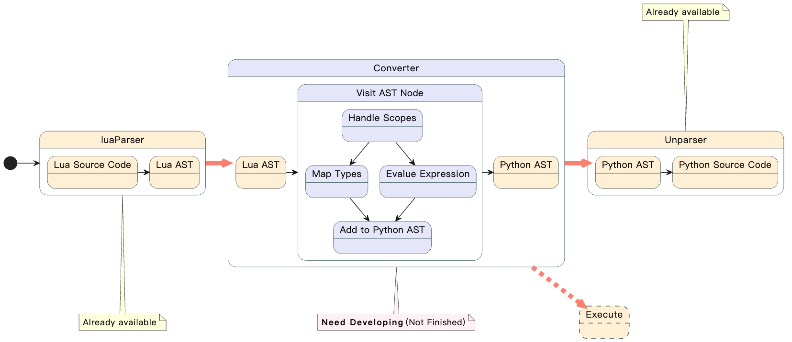

# lua2python
Lua-to-Python transpiler via AST manipulation: Parses Lua code, transforms its AST to Python AST, and generates Python source. Built with luaparser and astunparse.


## How to Run

```shell
pip install -r requirements.txt
python3 compile.py <source_file>
```

Example `python3 compile.py ./example/test.lua`

## Architecture



## Roadmap

- [x] Single line comments
- [x] Multiline comments
- [x] Numbers
- [x] Strings
- [x] Nil types

## Referrence

- [lua parser](https://github.com/boolangery/py-lua-parser)